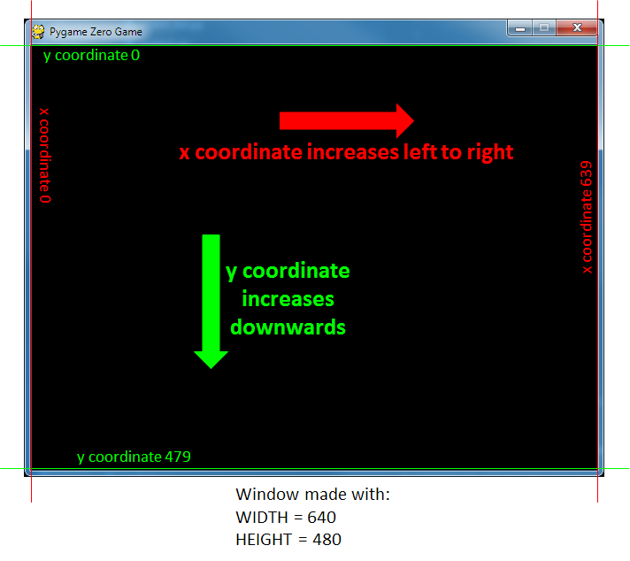

When you run code using Pygame Zero (you do this by typing 

```
pgzrun <name of python programme>.py
```

in a command window) a lot of things happen behind the scenes which you can't see.

Firstly, Pygame Zero creates a window for your code to operate in. In fact, even if you make a completely empty Python programme which has no text in it at all, then run it with pgzrun, Pygame Zero will create a window.

Make a folder
-------------

It's a good to make a folder for this project so that you can keep all the different samples of code together.

Create a new python file
------------------------

If you're using Python IDLE as the Python editor go to File>New File, then in the new window File>Save As... and save your empty file in your project folder. You should now open a Command Window and change the directory until you are in your project folder. In the command window you can type pgzrun 'name of python programme'.py and you should see a window appear. Kill the window by clicking the red cross in the top right corner.

If you're using Visual Studio Code it's really helpful to use File>Open Folder to open the project folder, instead of Open File. The left edge of the screen will then show a list of all the files in that folder (there aren't any yet). Use File>New File to create a new editing window, then File>Save As..., and give the new file a name and make sure you select Python from the list in the box Save as type:
Now go to View>Integrated Terminal and it should open a new terminal window at the bottom, which is already set to your project folder. In this window you can type pgzrun 'name of python programme'.py and it should display a window. Kill the window by clicking the red cross in the top right corner.

Controlling the window size
---------------------------

We can control the size of the Pygame Zero window by adding code like this into the .py file:

```
WIDTH=800
HEIGHT=600
```

Pygame Zero will use these commands to make a window which is 800 pixels wide and 600 pixels high. By changing the numbers you can make a window any size you want. But although WIDTH and HEIGHT have special meanings for Pygame Zero they are also just normal Python numerical variables, which means you can also use them in calculations.

When Pygame Zero makes a window it also creates a coordinate system to allow you to place objects in the window at the position you want. The x coordinate starts at 0 at the left edge of the window and increases to the right. If your window is 800 pixels wide then the extreme right edge of the window will have an x coordinate of 799.

The y coordinate starts at 0 at the top edge of the window and increases DOWNWARDS. Be careful! This is the opposite way round to coordinate systems in Scratch, or in normal graphs you might draw in maths. If your window is 600 pixels high then the extreme bottom edge of the window will have a y coordinate of 599.



Displaying something in the window
----------------------------------

If we want to display something in the window we need to create a function with the name draw:


```
def draw():
```

Pygame Zero always looks for a function called draw, and when it finds one it starts executing it over and over again, very fast (60 times a second). It does this behind the scenes without you having to write any code.

To display a letter A in the window, with its centre at coordinates x = 100, y = 100 we need to put this in the draw function:

```
screen.draw.text('A', center=(100,100))
```

Don't forget that this line needs to be indented, so that Python knows it is part of the draw function and not part of the rest of the code. Note also that Python commands are based on the spelling of American English, which means we have to use the American spelling "center" instead of the British "centre".

Save your file, and run it using pgzrun, to check that a letter appears. You will have to kill the window by clicking on the red cross in the top right corner before you can continue.

Challenge:
==========
use what you know about the coordinate system to get the letter A (or whatever letter you like) to appear exactly in the centre of your window. You can do this by changing the numbers in the part of the code which says center=(100,100).

If you have made the letter appear in the centre of the window you might have done some division sums. But if you decided you wanted to change the size of the window would the letter still be in the centre?

Challenge:
==========
change your code so that the letter will appear in the centre of the window whatever size of window you choose. Remember that WIDTH and HEIGHT are Python variables, so you can use them in calculations.

[Go to step 2](../Step2-move_letter/move_letter.md)

