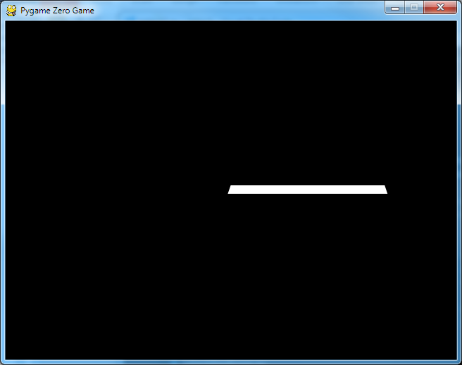

Using variables for coordinates
-------------------------------

To make the letter move around the screen we need to change its coordinates. These are the values in part of the screen.draw.text statement in the brackets next to center=

The easiest way to have coordinates which can be changed is to use variables for the x and y coordinates. You can give these any name, but here we will call them x and y. 

To make variables you need to have statements like x = 0, or y = 100 in the part of the code below the WIDTH and HEIGHT statements. These statements will both create the variables, and give them initial values. Because the values are numbers, Python understands that these new variables will be numerical variables.

This code will create new variables and give them initial values which represent the centre of the window:
```
x = WIDTH/2
y = HEIGHT/2
```
These statements need to be placed after the WIDTH and HEIGHT statements because they use the values of WIDTH and HEIGHT in the calculation. If you placed these before the WIDTH and HEIGHT statements Python would give an error because it would be trying to do a calculation using a variable called WIDTH before you'd even told Python that there was such a variable or what its value was.

One suggestion is to try this - put the two statements for x and y before the statements for WIDTH and HEIGHT, run the code using pgzrun, and see what the error is. Then, in the future, if you ever see the same error you will have a good idea what the problem is, and how to fix it.

In the draw function we need to change the coordinates in center= so that for the x coordinate it will use the variable x, and for the y coordinate it will use the variable y.

Make these changes and check if the letter displays properly.

Moving the letter
-----------------

We've already said that Pygame Zero looks for a function called draw in the code, but at the same time it also looks for a function called update. If it finds one it executes update first, then draw, and keeps repeating this sequence update, draw, update, draw 60 times a second. 

This means that if we make changes to the x and y coordinates in the update function, Pygame Zero will immediately afterwards draw the letter with the new coordinates. This is how to make the letter move around the screen.

Create the function update using this code, and put it just above the function draw:
```
def update():
    x = x + 1
```
The Python code inside the function looks like mathematical nonsense, but to Python it means: take the present value of the variable x, add 1 to it and put this new value back in the variable x. If you remember that x is the x coordinate of the letter in the window what effect do you think this change of variable x would have on the position of the letter?


Scope of variables
------------------

Unfortunately if we run the code using pgzrun like this it will give an error. This is because of something called the scope of variables.

In Python you can create variables either inside a function, or outside all functions. Variables created outside of all functions are called global variables. In this programme WIDTH, HEIGHT, x and y are examples of global variables because the statements that create them are not inside any function.

Variables can also be created inside a function and these are called local variables. A local variable can only be used inside the function where it was created. In technical terms we say the variable has a local "scope". In fact, even if a local variable has exactly the same name as a global variable Python will treat them completely separately as two different variables. 

When Python finds a variable inside a function it assumes it is a local variable attached to the function. In our code Python finds a reference to a variable x inside the function update, so it assumes this is a local variable. But we haven't created a local variable x inside the function, so Python is confused and gives an error.

What we need is a way of telling Python that variable x inside the function update is NOT a local variable, but the same global variable which we created outside of any function. The way to do this is to add this code as the first line of the function:

```
global x
```

Don't forget to indent this line.

The Python code [letterA1.py](letterA1.py) included with this step shows the code as it might look at this stage.

You will see that there are lots of lines in this code which begin with #. These are *comments* which are simply information to tell someone looking at the code which bits of the code do what. Python ignores these, so they don't change the way the code runs, but they are fantastically useful when you are looking for errors in your code, as they help you quickly find the bit of code which might not be working properly. Using comments in your own code is a really good thing to do. 

Another very good thing to do is to put in blank lines to divide your code into different sections. It doesn't alter the way the code runs but it makes your code easier to understand.

Now, when we run the code with pgzrun, we should see the letter moving. Or do we?

You probably see a white line across the screen. But if you look closely you notice that the left and right edges of the line are sloping. Try to work out what's happening before looking further down to see the explanation.



Every time Pygame Zero runs the update function it increases the x coordinate by 1, then it runs the draw function and draws a letter A with the new coordinates. Next time around it does exactly the same thing. BUT WE HAVEN'T TOLD IT TO DELETE THE PREVIOUS LETTER A. So it keeps drawing new letter A's on top of all the old letter A's and makes what looks like a line.

We need to delete the previous letter A's before we draw a new one, and we do this by clearing the screen each time we run the update/draw functions. The way to do this is to add this code as the first line in function draw:

```
screen.clear()
```

Don't forget to indent this.

Now run the code with pgzrun and see if it makes a moving letter.

Challenge
=========
How would you make the letter move to the left? upwards? downwards? upwards and to the right at the same time?

Challenge
=========
How would you change the code to make the letter move faster?

[Go to step 3](../Step3-control_movement)
